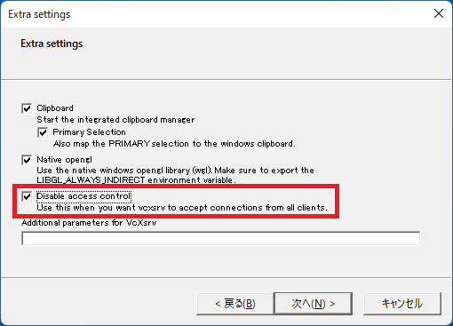

# Summary
- Provides `Dockerfile` for OpenVINO developers
- Enable SSH for easy development
- Enable X11 redirect to display grapnics on the host environment
- Setup some useful aliases for easy access to the OpenVINO tools
- Setup and start OpenVINO development in 5 min

## Description
Intel provides several types of OpenVINO Docker images but those images doesn't enable SSH. This project provides a `Dockerfile` which enables SSH. Developers can connect to the container with SSH client, and use X11 redirect to display graphics on the host machine.  


## How to build a Docker image
```sh
docker build -t openvino_dev_ssh .
```

## How to start a Docker container
Container will start and resides as a background process (daemon). SSH server will up and run, and wait for remote connection on port 22.
```sh
docker run -d --rm -p 22:22 --name ov -it openvino_dev_ssh
```
**Note:** To enable X11 redirect on Ubuntu system, user needs to add `-e DISPLAY=${DISPLAY} -v /tmp/.X11-unix/:/tmp/.X11-unix/` options. Refer to 'How to enable X11 redirect (Host=Ubuntu)' section for details.

**Linux users only**
- Enable integrated GPU.  
```sh
docker run -d --rm -p 22:22 --name ov -it --device=/dev/dri openvino_dev_ssh
```
- Enable VPU (Myriad-X, Neural Compute Stick 2:NCS2)
```sh
docker run -d --rm -p 22:22 --name ov -it --device=/dev/ion -v /var/tmp:/var/tmp openvino_dev_ssh
```
- Please refer to the OpenVINO official web documentation for details.  
[Run the Docker* Image for GPU](https://docs.openvino.ai/latest/openvino_docs_install_guides_installing_openvino_docker_linux.html#run-the-docker-image-for-gpu)  
[Use a Docker* Image for Intel® Neural Compute Stick 2](https://docs.openvino.ai/latest/openvino_docs_install_guides_installing_openvino_docker_linux.html#use-a-docker-image-for-intel-neural-compute-stick-2)
## How to connect to the container with ssh
You can use any ssh client program to connect to the container.  
```sh
ssh ovuser@localhost
```

## How to stop the container
**Caution:** The contents in the container will be lost when you stop the container if you put '`--rm`' option at the time when you start the container.
```sh
docker stop ov
```

## How to enable X11 redirect (Host=Windows)

### Install Xserver software
Win10/11 users need to install and start a X server program such as `VcXsrv`.  

### Disable access control in Xserver on host
Xservers denies remote access in default. You need to disable this access control to make the Xserver accepts the drawing request from remote programs.  
Windows user must refer to the Xserver document and disable the access control.  
'`VcXsrv`' has `Disable access control` check box in the dialog box which appears when you start the `XLaunch` app.    
  

### Set `DISPLAY` environment in the container to redirect X11 drawing to the host.
```sh
(container) export DISPLAY=192.168.1.21:0.0
Note: 192.168.1.21 is the host IP address
```
- Now you can run the X11 apps in the container

## How to enable X11 redirect (Host=Ubuntu)

### Disable access control in Xserver on host
Xservers denies remote access in default. You need to disable this access control to make the Xserver accepts the drawing request from remote programs.  
```sh
xhost +
```

### Share host X authentication info and DISPLAY environment variable
Add `-e DISPLAY=${DISPLAY} -v /tmp/.X11-unix/:/tmp/.X11-unix/` to `docker run` command line to share the host X authentication information with the container.

```sh
docker run -d --rm -p 22:22 --name ov -it -e DISPLAY=${DISPLAY} -v /tmp/.X11-unix/:/tmp/.X11-unix/ openvino_dev_ssh
```
- Now you can run the X11 apps in the container


## Building OpenVINO sample apps in the container  

- Build C++ sample apps  
Built binaries can be found in `~/inference_engine_cpp_samples_build/intel64/Release/`
```sh
cd ${INTEL_OPENVINO_DIR}/deployment_tools/inference_engine/samples/cpp/
./build_samples.sh 
```
- Build C sample apps  
Built binaries can be found in `~/inference_engine_c_samples_build/intel64/Release/`
```sh
cd ${INTEL_OPENVINO_DIR}/deployment_tools/inference_engine/samples/c/
./build_samples.sh 
```
-  Copy Python demos to the user directory  
```sh
cp -r ${INTEL_OPENVINO_DIR}/deployment_tools/inference_engine/samples/python/ ~/python_demos
```

## Running OpenVINO sample apps
- Image classification sample app  

Copy input image files.
```sh
cd ~
cp $INTEL_OPENVINO_DIR/deployment_tools/demo/car.png .
cp $INTEL_OPENVINO_DIR/deployment_tools/demo/car_1.bmp .
```
Download a DL model with model downloader.
```sh
omz_downloader --name googlenet-v1-tf
omz_converter --name googlenet-v1-tf --precisions FP16
```
Run a C++ image classification sample app.
```sh
inference_engine_cpp_samples_build/intel64/Release/classification_sample_async -m public/googlenet-v1-tf/FP16/googlenet-v1-tf.xml -i car.png 
```
Run a Python image classification sample app.
```sh
python3 python_demos/hello_classification/hello_classification.py -m public/googlenet-v1-tf/FP16/googlenet-v1-tf.xml -i car.png 

```

## Using webCam from the apps in the container (Linux only) 
Linux can share USB webCam device with the container.
Add `--device=/dev/video0` to `docker run` command line.


## Others
The `Dockerfile` setup some aliases to the OpenVINO tools for developers convenience. Developers can access to the tools without remembering the long-and-deep path to the command.
|alias/command|tool|description|
|---|---|---|
|omz_downloader|OMZ* model downloader|Download OMZ models by specifying the model name|
|omz_converter|OMZ* model converter|Convert downloaded OMZ models in framework format into OpenVINO IR model format|
|omz_quantizer|OMZ* model quantizer|Quantize OMZ IR models into INT8 precision|
|omz_info_dumper|OMZ* model info dumper|Display OMZ model information|
|benchmark_app|Benchmark app|Run IR model benchmark with various options|
|mo.py|Model Optimizer|Convert and optimize DL models in framework format into OpenVINO IR format|
|accuracy_check|Accuracy Checker|Check inference accuracy of an OpenVINO IR model|
|pot|Post-training Optimization Tool|Quantize IR model into INT8|

Note: OMZ = Intel Open Model Zoo
